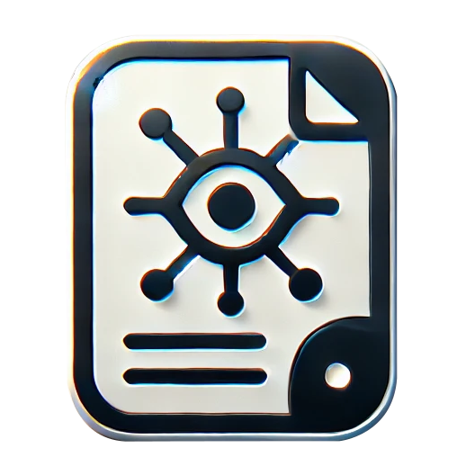

<!-- PROJECT LOGO -->
<br />
<div align="center">
  <a href="">
    
  </a>

<h3 align="center">NoteWise: AI-Powered Notes Enhancement</h3>
  
  <p align="center">
    A Vite frontend solution for comparing and enhancing student-written lecture notes with transcript data using Gemini and Ollama.
    <br />
    <a href=""><strong>Explore the docs »</strong></a>
    <br />
    <br />
    <a href="">Report Bug</a>
    ·
    <a href="">Request Feature</a>
  </p>
</div>

<!-- TABLE OF CONTENTS -->
<details>
  <summary>Table of Contents</summary>
  <ol>
    <li>
      <a href="#about-the-project">About The Project</a>
      <ul>
        <li><a href="#built-with">Built With</a></li>
      </ul>
    </li>
    <li>
      <a href="#getting-started">Getting Started</a>
      <ul>
        <li><a href="#prerequisites">Prerequisites</a></li>
        <li><a href="#installation">Installation</a></li>
      </ul>
    </li>
    <li><a href="#usage">Usage</a></li>
    <li><a href="#troubleshooting">Troubleshooting</a></li>
    <li><a href="#contact">Contact</a></li>
  </ol>
</details><br>

<!-- ABOUT THE PROJECT -->
## About The Project

This Vite frontend is designed to enhance notes and transcript data by comparing them using AI models such as Gemini and Ollama. The solution processes uploaded lecture notes and transcript files, divides them into manageable chunks, and applies AI models to fill in any missing gaps.

<p align="right">(<a href="#readme-top">back to top</a>)</p>

### Built With

* [Python](https://python.com)
* [Vite](https://vite.dev/)
* [Ollama](https://ollama.com/)
* [Gemini API](https://developers.google.com/genai)

<p align="right">(<a href="#readme-top">back to top</a>)</p>

<!-- GETTING STARTED -->
## Getting Started

To get a local copy up and running follow these simple steps:
*Note*: Windows steps assume that you're using PowerShell from within the [Windows Terminal](https://apps.microsoft.com/store/detail/windows-terminal/9N0DX20HK701?hl=en-gb&gl=gb&rtc=1) app.

### Cloning the repository

```bash
> git clone https://github.com/KVVT-LeedsHack/leedshack.git notes-comparison
```

### Running and testing the backend APIs

1. Install Ollama.

Choose an appropriate version [here](https://ollama.com/download).

You should also pull a model you want to use like this:
```bash
> ollama pull deepseek-r1:1.5b`
```

This will download the model to your machine.

2. Install requirements.
```bash
> pip install -r requirements.txt
```

3. Run the backend.
```bash 
> uvicorn main:app --reload
```

4. Test the endpoint.
You can test the endpoint by running the `request.py` script by:
```bash 
> python request.py
```

